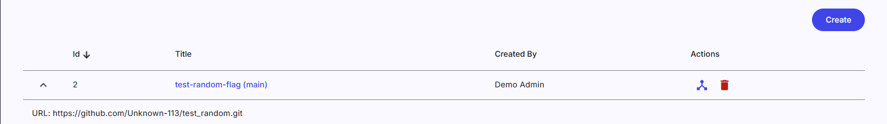

# Sandbox Agenda

## I. Tổng quan

### 1. Khái niệm

**Sandbox Agenda** là khu vực trung tâm của CyberRangeCZ Platform dùng để tạo và quản lý môi trường sandbox phục vụ đào tạo.

### 2. Chức năng chính

- Tạo và quản lý **Sandbox Definition**
- Quản lý **Pool**
- Theo dõi và điều khiển **Sandbox Instances**
- Quản lý **Images**

### 3. Truy cập

- Nhấp vào nút tương ứng trên trang chính của web
- Hoặc trong phần điều hướng ở Sandboxes

### 4. Luồng hoạt động

> 💡 Workflow chính:
>
> 1. Tạo Sandbox Definition (mô tả hệ thống)
> 2. Tạo Pool từ Definition
> 3. Allocate để tạo Sandbox Instances
> 4. Quản lý vòng đời (lock, delete, retry, ...)

---

## II. Sandbox Definition

### 1. Khái niệm

**Sandbox Definition** là bản mô tả (blueprint) của một môi trường sandbox, bao gồm:

- Cấu trúc mạng (topology)
- Các máy ảo (VMs)
- Cấu hình hệ thống
- Script provisioning

Mỗi definition được lưu trữ dưới dạng **Git repository**.

### 2. Sandbox Definition Overview

Hiển thị tất cả sandbox definitions trong hệ thống.

- Mỗi dòng tương ứng một definition
- Có thể dùng để tạo nhiều pool

#### a. Các thao tác

##### 🔍 Xem chi tiết

- Nhấn vào tên để xem thông tin hoặc truy cập repository

##### 🌐 Xem topology

Hiển thị sơ đồ mạng gồm:

- Router
- Switch
- Hosts
- Kết nối giữa các node

→ Giúp kiểm tra cấu trúc trước khi triển khai

##### 🗑️ Xóa definition

- Xóa sandbox definition khỏi hệ thống

> ⚠️ Definition không được gán vào bất kỳ pool nào

### 3. Tạo Sandbox Definition

#### ➕ Tạo mới (Create)

1. Nhấn **Create**
2. Nhập:
   - **Git URL**
   - **Revision** (thường là `master`)
3. Nhấn **Create**

#### ⚙️ Hệ thống xử lý

- Clone repository
- Phân tích cấu trúc
- Kiểm tra hợp lệ

→ Nếu sai format → tạo thất bại

---

## III. Pool

### 1. Khái niệm

**Pool** là nơi chứa và quản lý sandbox instances từ một definition.

#### Vai trò:

- Quản lý tài nguyên runtime
- Điều phối tạo sandbox
- Theo dõi trạng thái sử dụng

### 2. Tổng quan & thao tác Pool

Trang này hiển thị danh sách các pool hiện có, bao gồm:

- Tên pool
- Sandbox definition
- Trạng thái
- Mức sử dụng tài nguyên

Các hành động chính:

- 📝 **Chỉnh sửa**: cập nhật cấu hình pool
- 📦 **Allocate**: tạo nhiều sandbox (auto nếu còn 1)
- ➕ **Allocate 1**: tạo nhanh 1 sandbox
- 🗑️ **Xóa**: khi pool không lock & không có instance
- 🔒 / 🔓 **Lock / Unlock**: khóa / mở pool
- 📊 **Tài nguyên**: xem usage (CPU, RAM, network…)

### 3. Tạo Pool

#### ➕ Tạo Pool

1. Nhấn **Create**
2. Nhập:
   - Sandbox Pool Size
   - Sandbox Definition
   - Comment (optional)
   - Notification (optional)
3. Nhấn **Create**

#### ⚠️ Lưu ý

- Pool chỉ gắn với **1 definition cố định**
- Muốn đổi version → tạo pool mới

---

## IV. Pool Detail

### 1. Mô tả

Danh sách sandbox instances trong pool.

### 2. Thao tác

- 📦 **Allocate**: tạo nhiều sandbox (nhập số lượng hoặc dùng slider)
- 🗑️ **Xóa**: chỉ khi sandbox chưa lock
- 🔒 / 🔓 **Lock / Unlock**: khóa / mở sandbox

---

## V. Sandbox Instances

### 1. Mô tả

Danh sách sandbox được tạo từ pool.

### 2. Thao tác

- 🗑️ **Xóa**: chỉ khi chưa lock
- 🌐 **Topology**: xem sơ đồ mạng
- 🔑 **SSH Config**: tải file truy cập
- 🔒 / 🔓 **Lock / Unlock**: khóa / mở sandbox
  

---

## VI. Quá trình tạo sandbox

### 1. Các giai đoạn

1. Tạo hạ tầng (Terraform)
2. Cấu hình mạng (Ansible)
3. Provisioning hệ thống

### 2. Trạng thái

| Trạng thái | Ý nghĩa        |
| ---------- | -------------- |
| In Queue   | Đang chờ xử lý |
| Running    | Đang thực thi  |
| Finished   | Hoàn thành     |
| Failed     | Lỗi            |

### 3. Retry

#### 🔄 Retry

- Có thể retry stage lỗi
- Chỉ hỗ trợ một số stage

### 4. Xem chi tiết

#### 🔍 Xem log

- Nhấn vào sandbox
- Xem log từng stage

---

## VII. Images

### 1. Khái niệm

Images là hệ điều hành dùng để tạo VM trong sandbox.

### 2. Danh sách

Hiển thị các thông tin:

- Name
- Default User
- Updated At
- GUI Access
- Size

### 3. Chi tiết

Bao gồm:

- OS Distro, OS Type
- Disk / Container Format
- Min Disk, Min RAM
- Visibility, Created At
- Tags, Version

### 4. Bộ lọc

- 🔎 Only CRCZP images
- 🔎 Only GUI access

→ Giúp tìm image nhanh hơn

---

## VIII. Tổng kết

Sandbox Agenda gồm 4 thành phần chính:

1. **Sandbox Definition** – mô tả hệ thống
2. **Pool** – quản lý tài nguyên
3. **Sandbox Instances** – môi trường thực thi
4. **Images** – hệ điều hành
